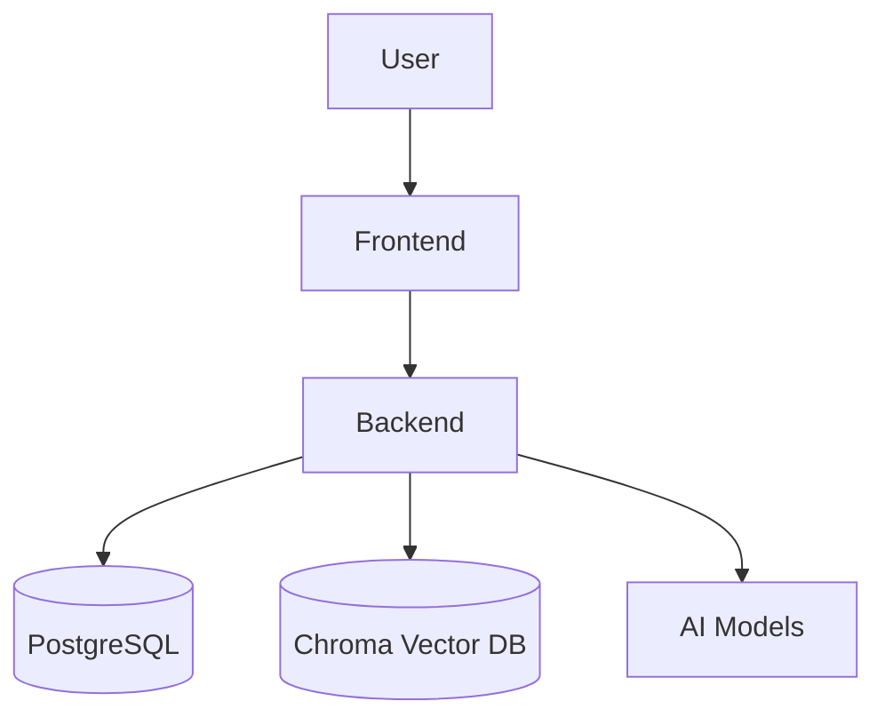
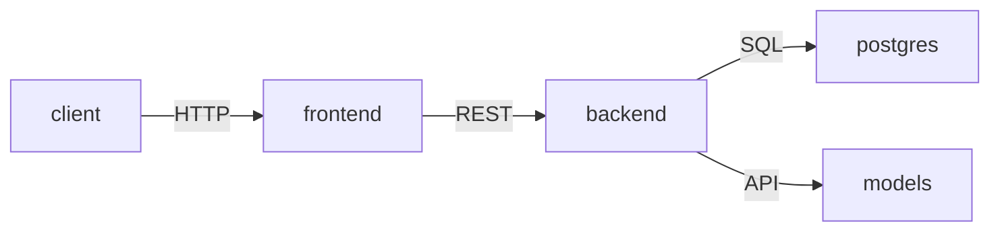

# System Architecture

```mermaid
graph TD
  A[User] --> B[Frontend]
  B --> C[Backend]
  C --> D[(PostgreSQL)]
  C --> E[(Chroma Vector DB)]
  C --> F[AI Models]
```

## Data Flow

```mermaid
flowchart LR
  client -->|HTTP| frontend
  frontend -->|REST| backend
  backend -->|SQL| postgres
  backend -->|API| models
```
